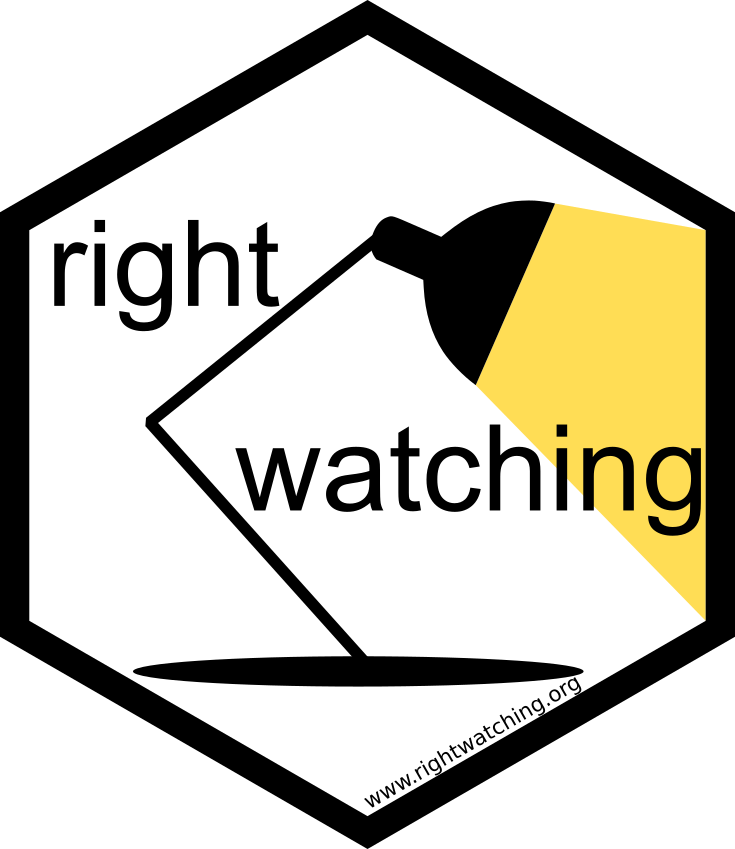

<!-- README.md is generated from README.Rmd. Please edit that file -->

```{r, include = FALSE}
knitr::opts_chunk$set(
  collapse = TRUE,
  comment = "#>",
  fig.path = "man/figures/README-",
  out.width = "100%"
)
```

# rightwatching  <a href='https://rightwatching.org'></a>

<!-- badges: start -->
<!-- badges: end -->

The goal of rightwatching is to help small watchdogs keeping track of developments in right-wing violence. 


## Using as Docker app

Rightwatching is a dockerized Shiny app. The app depends on RData files containing the data of far-right incidents and other external data. To create these RData files:

* Clone and change into the data-raw directory. Build the container with `docker build . -t rightwatching-get-data`. 
* This container would run on a docker host periodically and check scrape incidents of far right violence. Currently it scrapes incidents from three different sources. 
* It runs through a sequence of steps according to the data-raw directory (prepare.R). All data files will be saved in the data directory.

The Shiny app expects the same variables as in the RData environment. Once you have these, launch the Shiny app
  
* Change into this directory and build the image with `docker build . -t rightwatching-shiny-app`. This will take a long time at first run. 
* This container does not need to be run manually, it should be called from shinyproxy (You must specify the container in application.yml of shinyproxy)
* For testing, it an be run manually. It will expose the Shiny app on port 3838. Use `docker logs name_of_container` for debugging
	* run manually like this: docker run -p 3838:3838 -v /path/to/this/diectory/data/:/srv/data/ -v //path/to/this/diectory/data-raw/:/srv/prepare/ rightwatching-shiny-app


## Using as package


<a href='https://rightwatching.org'></a>
